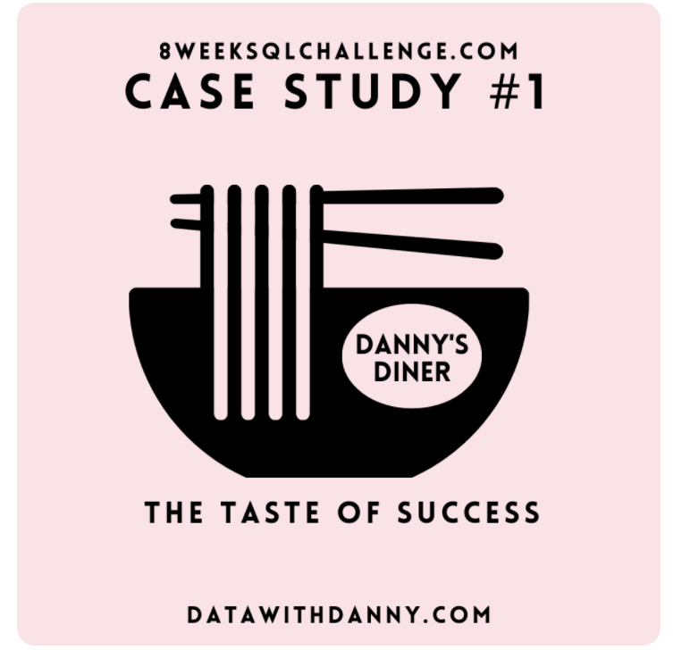
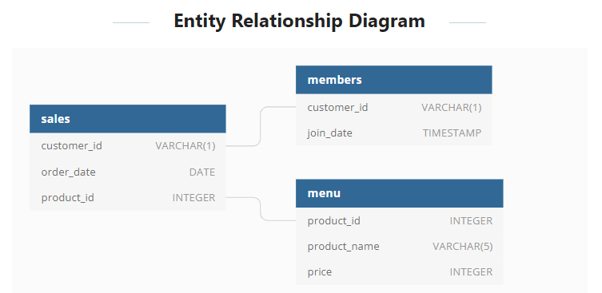
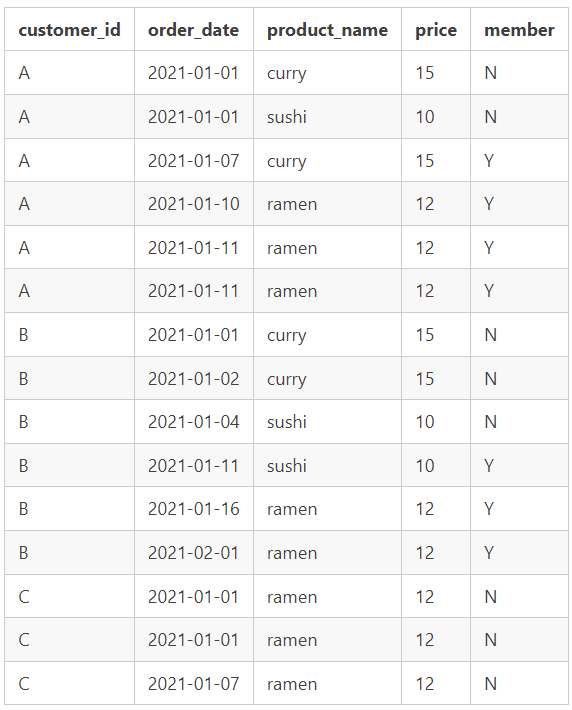
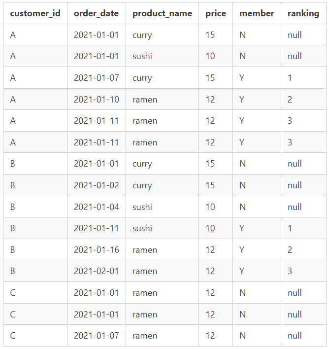

# Case Study 1: Danny's Diner # 🍛🍣

### Case study 1 has 4 SQL files ###
members_table.sql -> for creating members table and inserting values in members table.

menu_table.sql -> for creating menu table and inserting values in menu table.

sales_table.sql -> for creating sales table and inserting values in sales table.

case_study.sql -> question and code to find all answers.

### Introduction ###
 - This is 1st case study of total 8 case studies. 
 - Entity relationship diagram.
	
 - It consist of 3 tables members, sales and menu.
 - The sample [data](https://8weeksqlchallenge.com/case-study-1/) is provided by danny.
 - I used Microsoft SQL server to solve the problems. 

### Case Study Question ###
1. What is the total amount each customer spent at the restaurant?
2. How many days has each customer visited the restaurant?
3. What was the first item from the menu purchased by each customer?
4. What is the most purchased item on the menu and how many times was it purchased by all customers?
5. Which item was the most popular for each customer?
6. Which item was purchased first by the customer after they became a member?
7. Which item was purchased just before the customer became a member?
8. What is the total items and amount spent for each member before they became a member?
9. If each $1 spent equates to 10 points and sushi has a 2x points multiplier - how many points would each customer have?
10.In the first week after a customer joins the program (including their join date) they earn 2x points on all items, not just sushi - how many points do customer A and B have at the end of January?

### Bonus Question ###
1. The following questions are related creating basic data tables that Danny and his team can use to quickly derive insights without needing to join the underlying tables using SQL.
   Recreate the following table output using the available data:

2. Danny also requires further information about the ranking of customer products, but he purposely does not need the ranking for non-member purchases so he expects null ranking values for the records when customers are not yet part of the loyalty program.

### After Case study my Interesting suggestion to danny ###

- Customer A spent $76, Customer B spent $74, Customer C spent $36.
- Customer B visited most number of times 6 followed by Customer A 4 and cutomer c with 2 visits.
- Curry is the most common 1st order.
- Ramen is most frequent dish orded by all customers.
- Most frequest order by customers:
				A -> Sushi
				B -> Ramen, Curry, Sushi
				C -> Ramen
- Money spent and total items orderd before customer becomes member.
	Customer A spent $25 and ordered 2 items.
	Customer B spent $40 and ordered 3 items.
	Customer C is not member yet.
