# Case Study Solution 🍛🍣

### 1. What is the total amount each customer spent at the restaurant?

**Answer:**

````sql
SELECT s.customer_id,
       sum(men.price) AS total_price
FROM sales s,
     menu men
WHERE s.product_id = men.product_id
GROUP BY s.customer_id;
````

**Output:**

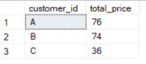


### 2. How many days has each customer visited the restaurant?

**Answer:**

````sql
SELECT s.customer_id,
       count(distinct(s.order_date)) AS total_days_visited
FROM sales s
GROUP BY (s.customer_id);
````

**Output:**
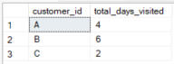


### 3. What was the first item from the menu purchased by each customer?

**Answer:**

````sql
WITH first_item_purchased_cre AS
  (SELECT men.product_name,
          s.customer_id,
          s.order_date,
          rank() over(PARTITION BY s.customer_id
                      ORDER BY s.order_date) AS order_number
   FROM sales s,
        menu men
   WHERE s.product_id = men.product_id)
SELECT customer_id,
       product_name
FROM first_item_purchased_cre
WHERE order_number=1;
````

**Output:**

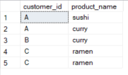


### 4. What is the most purchased item on the menu and how many times was it purchased by all customers?

**Answer:**

````sql
SELECT top 1 m.product_name,
           count(s.product_id) AS total_orders
FROM menu m,
     sales s
WHERE s.product_id = m.product_id
GROUP BY m.product_name
ORDER BY count(s.product_id) DESC;
````

**Output:**

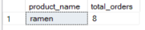


### 5. Which item was the most popular for each customer?

**Answer:**

````sql
WITH popular_item_cte AS
  (SELECT s.customer_id,
          m.product_name,
          count(s.product_id) AS order_count,
          dense_rank() over(PARTITION BY customer_id
                            ORDER BY count(customer_id) DESC) AS ranking
   FROM sales s,
        menu m
   WHERE s.product_id = m.product_id
   GROUP BY s.customer_id,
            m.product_name)
SELECT *
FROM popular_item_cte
WHERE ranking = 1;
````

**Output:**

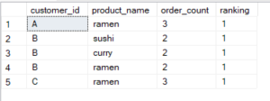


### 6. Which item was purchased first by the customer after they became a member?

** Answer: **

With items_purchased_after_member as
  (SELECT s.customer_id,
          s.order_date,
          men.product_name,
          dense_rank() over(PARTITION BY s.customer_id
                            ORDER BY order_date) AS ranking
   FROM sales s,
        members m,
        menu men
   WHERE m.customer_id = s.customer_id
     AND s.product_id = men.product_id
     AND s.order_date>=m.join_date) 
SELECT *
FROM items_purchased_after_member
WHERE ranking = 1;


**Output:**

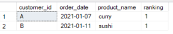


### 7. Which item was purchased just before the customer became a member?

**Answer:**

````sql
WITH items_purchased_before_member AS
  (SELECT s.customer_id,
          men.product_name,
          s.order_date,
          dense_rank() over(PARTITION BY s.customer_id
                            ORDER BY order_date) AS ranking
   FROM members mem,
        sales s,
        menu men
   WHERE mem.customer_id = s.customer_id
     AND s.product_id = men.product_id
     AND s.order_date<mem.join_date)
SELECT *
FROM items_purchased_before_member
WHERE ranking = 1;
````

**Output:**

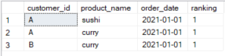


### 8. What is the total items and amount spent for each member before they became a member?

**Answer:**

````sql
SELECT s.customer_id,
       sum(men.price) AS total_spent,
       count(s.product_id) AS total_item
FROM sales s,
     menu men,
     members mem
WHERE mem.customer_id = s.customer_id
  AND s.product_id = men.product_id
  AND mem.join_date>s.order_date
GROUP BY s.customer_id;
````

**Output:**

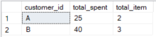


### 9.  If each $1 spent equates to 10 points and sushi has a 2x points multiplier - how many points would each customer have?

**Answer:**

````sql
WITH prod_points_cte AS
  (SELECT customer_id,
          s.product_id,
          price,
          count(s.product_id) AS total_orders,
          CASE
              WHEN s.product_id =
                     (SELECT product_id
                      FROM menu
                      WHERE product_name = 'sushi') THEN 20
              ELSE 10
          END AS points
   FROM sales s,
        menu m
   WHERE s.product_id = m.product_id
   GROUP BY customer_id,
            s.product_id,
            price)
SELECT customer_id,
       sum(price*total_orders*points) AS total_points
FROM prod_points_cte
GROUP BY customer_id;
````

**Output:**

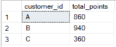


### 10. In the first week after a customer joins the program (including their join date) they earn 2x points on all items, not just sushi - how many points do customer A and B have at the end of January?

**Answer:**

````sql
WITH sales_week_diff AS
  (SELECT s.customer_id,
          s.order_date,
          s.product_id,
          datediff(WEEK, m.join_date, s.order_date) week_diff
   FROM sales s,
        members m
   WHERE s.customer_id = m.customer_id),
     prod_points1 AS
  (SELECT customer_id,
          s.week_diff,
          s.product_id,
          price,
          count(s.product_id) AS total_orders,
          CASE
              WHEN s.product_id =
                     (SELECT product_id
                      FROM menu
                      WHERE product_name = 'sushi') THEN 20
              WHEN s.week_diff BETWEEN 0 AND 1 THEN 20
              ELSE 10
          END AS points
   FROM sales_week_diff s,
        menu m
   WHERE s.product_id = m.product_id
   GROUP BY customer_id,
            s.product_id,
            price,
            s.week_diff)
SELECT customer_id,
       sum(price*total_orders*points) AS total_points
FROM prod_points1
GROUP BY customer_id;
````

**Output:**

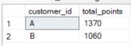


## Bonus Question
### 1. Join all
### The following questions are related creating basic data tables that Danny and his team can use to quickly derive insights without needing to join the underlying tables using SQL.

**Answer:**

````sql
WITH join_all_cte AS
  (SELECT s.customer_id,
          s.order_date,
          men.product_name,
          men.price,
          CASE
              WHEN s.order_date>= m.join_date THEN 'Y'
              ELSE 'N'
          END AS members
   FROM sales s
   LEFT JOIN members m ON s.customer_id = m.customer_id
   INNER JOIN menu men ON s.product_id = men.product_id)
SELECT *
FROM join_all_cte;
````

**Output:**


### 2. Rank All
### Danny also requires further information about the ranking of customer products, but he purposely does not need the ranking for non-member purchases so he expects null ranking values for the records when customers are not yet part of the loyalty program.

**Answer:**

````sql
WITH ranking_cte AS
  (SELECT *,
          CASE
              WHEN members = 'N' THEN NULL
              ELSE dense_rank() over(PARTITION BY customer_id, members
                                     ORDER BY order_date)
          END AS ranking
   FROM join_all)
SELECT *
FROM ranking;
````

**Output:**

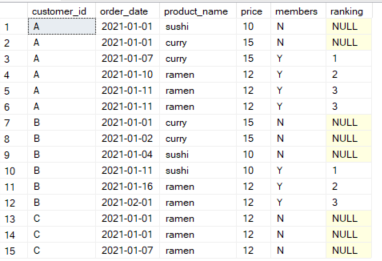


