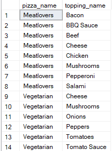
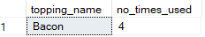
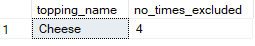

# C. Ingredient Optimisation #

#### 1. What are the standard ingredients for each pizza?

**Answer:**

````sql
WITH pizza_ingrdients_cte
     AS (SELECT pizza_id,
                value AS toppings
         FROM   pizza_recipes
                CROSS apply String_split(toppings, ','))
SELECT pizza_name,
       topping_name
FROM   pizza_toppings pt,
       pizza_ingrdients_cte pic,
       pizza_names pn
WHERE  topping_id = toppings
       AND pic.pizza_id = pn.pizza_id; 
````

**Output:**



#### 2. What was the most commonly added extra?

**Answer:**

````sql
WITH extra_cte
     AS (SELECT pizza_id,
                value AS extras_toppings
         FROM   customer_orders_clean
                CROSS apply String_split(extras, ','))
SELECT TOP 1 topping_name,
             Count(extras_toppings) AS no_times_used
FROM   pizza_toppings,
       extra_cte
WHERE  topping_id = extras_toppings
GROUP  BY topping_name
ORDER  BY Count(extras_toppings) DESC; 
````

**Output:**



#### 3. What was the most common exclusion?

**Answer:**

````sql
WITH exclusion_cte
     AS (SELECT pizza_id,
                value AS exclusion_toppings
         FROM   customer_orders_clean
                CROSS apply String_split(exclusions, ','))
SELECT TOP 1 topping_name,
             Count(exclusion_toppings) AS no_times_excluded
FROM   pizza_toppings,
       exclusion_cte
WHERE  topping_id = exclusion_toppings
GROUP  BY topping_name
ORDER  BY Count(exclusion_toppings) DESC; 
````

**Output:**



#### 4. Generate an order item for each record in the customers_orders table in the format of one of the following:
- Meat Lovers
- Meat Lovers - Exclude Beef
- Meat Lovers - Extra Bacon
- Meat Lovers - Exclude Cheese, Bacon - Extra Mushroom, Peppers

**Coming Soon**


#### 5. Generate an alphabetically ordered comma separated ingredient list for each pizza order from the customer_orders table and add a 2x in front of any relevant ingredients
#### For example: "Meat Lovers: 2xBacon, Beef, ... , Salami" */ ####

**Coming Soon**


#### 6. What is the total quantity of each ingredient used in all delivered pizzas sorted by most frequent first?

**Coming Soon**

