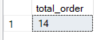
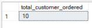
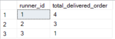
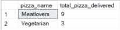
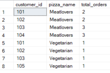
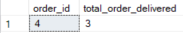
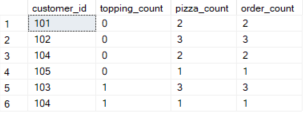
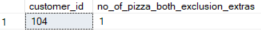
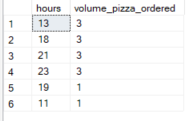
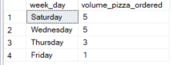

# A. Pizza Metrics Solution 

### 1.How many pizzas were ordered? ###

**Answer:**

````sql
SELECT count(order_id) AS total_order
FROM customer_orders_clean;
````

**Output:**



#### 2.How many unique customer orders were made? ####

**Answer:**

````sql
SELECT count(DISTINCT order_id) AS total_customer_ordered
FROM customer_orders_clean;
````

**Output:**



#### 3.How many successful orders were delivered by each runner? ####

**Answer:**

````sql
SELECT runner_id,
       count(order_id) AS total_delivered_order
FROM runner_orders_clean
WHERE distance IS NOT NULL
GROUP BY runner_id;
````

**Output:**



#### 4.How many of each type of pizza was delivered? ####

**Answer:**

````sql
SELECT p.pizza_name,
       count(r.runner_id) AS total_pizza_delivered
FROM pizza_names_clean p,
     customer_orders_clean c,
     runner_orders_clean r
WHERE c.pizza_id = p.pizza_id
  AND c.order_id = r.order_id
  AND pickup_time IS NOT NULL
GROUP BY p.pizza_name;
````

**Output:**



#### 5.How many Vegetarian and Meatlovers were ordered by each customer? ####

**Answer:**

````sql
SELECT c.customer_id,
       p.pizza_name,
       count(c.order_id) AS total_orders
FROM customer_orders_clean c,
     pizza_names p
WHERE c.pizza_id = p.pizza_id
GROUP BY c.customer_id,
         pizza_name;
 ````

**Output:**



#### 6.What was the maximum number of pizzas delivered in a single order? ####

**Answer:**

````sql
SELECT top 1 c.order_id,
           count(c.pizza_id) AS total_order_delivered
FROM customer_orders_clean c,
     runner_orders_clean r
WHERE c.order_id = r.order_id
  AND r.pickup_time IS NOT NULL
GROUP BY c.order_id
ORDER BY count(c.pizza_id) DESC;
````

**Output:**



#### 7.For each customer, how many delivered pizzas had at least 1 change and how many had no changes? ####

**Answer:**

````sql
WITH topping_count_cte AS
  (SELECT c.customer_id,
          c.order_id,
          c.pizza_id,
          c.exclusions,
          r.distance,
          CASE
              WHEN c.exclusions IS NOT NULL THEN 1
              ELSE 0
          END AS topping_count
   FROM customer_orders_clean c,
        runner_orders_clean r
   WHERE c.order_id = r.order_id
     AND r.distance IS NOT NULL)
SELECT t.customer_id,
       t.topping_count,
       count(t.pizza_id) AS pizza_count,
       count(t.order_id) AS order_count
FROM topping_count_cte t
GROUP BY t.topping_count,
         t.customer_id;
````

**Output:**



#### 8.How many pizzas were delivered that had both exclusions and extras? ####

**Answer:**

````sql
 WITH exclusion_extras_cte AS
  (SELECT c.customer_id,
          c.order_id,
          c.pizza_id,
          c.exclusions,
          r.distance,
          c.extras
   FROM customer_orders_clean c,
        runner_orders_clean r
   WHERE c.order_id = r.order_id
     AND r.distance IS NOT NULL)
SELECT customer_id,
       count(pizza_id) AS no_of_pizza_both_exclusion_extras
FROM exclusion_extras_cte
WHERE exclusions IS NOT NULL
  AND extras IS NOT NULL
  AND distance IS NOT NULL
GROUP BY customer_id;
````

**Output:**



#### 9.What was the total volume of pizzas ordered for each hour of the day? ####

**Answer:**

````sql
SELECT DATEPART(HOUR, order_time) AS hours,
       count(order_id) AS volume_pizza_ordered
FROM customer_orders_clean
GROUP BY DATEPART(HOUR, order_time)
ORDER BY count(order_id) DESC;
````

**Output:**



#### 10.What was the volume of orders for each day of the week? ####

**Answer:**

````sql
SELECT DATENAME(weekday, order_time) AS week_day,
       count(order_id) AS volume_pizza_ordered
FROM customer_orders_clean
GROUP BY DATENAME(weekday, order_time)
ORDER BY count(order_id) DESC;
````

**Output:**


