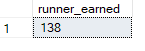
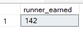
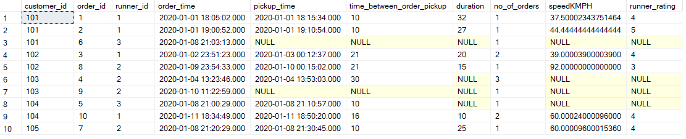
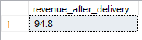

# D. Pricing and Ratings

#### 1. If a Meat Lovers pizza costs $12 and Vegetarian costs $10 and there were no charges for changes - how much money has Pizza Runner made so far if there are no delivery fees?

**Answer:**

````sql
WITH customer_orders_clean_cost
     AS (SELECT c.order_id,
                customer_id,
                c.pizza_id,
                runner_id,
                distance,
                CASE
                  WHEN pizza_name = 'Meatlovers' THEN 12
                  ELSE 10
                END AS cost
         FROM   runner_orders_clean r,
                customer_orders_clean c,
                pizza_names_clean p
         WHERE  r.order_id = c.order_id
                AND c.pizza_id = p.pizza_id)
SELECT Sum(cost) AS runner_earned
FROM   customer_orders_clean_cost
WHERE  distance IS NOT NULL;
````

**Output:**



#### 2. What if there was an additional $1 charge for any pizza extras?
- **Add cheese is $1 extra**

**Answer:**

````sql
WITH customer_orders_clean_cost
AS (SELECT
  c.order_id,
  customer_id,
  c.pizza_id,
  runner_id,
  distance,
  (
  LEN(extras) - LEN(
  REPLACE(extras, ',', '')
  ) + 1
  ) AS no_of_toppings,
  CASE
    WHEN pizza_name = 'Meatlovers' THEN 12
    ELSE 10
  END AS cost
FROM runner_orders_clean r,
     customer_orders_clean c,
     pizza_names_clean p
WHERE r.order_id = c.order_id
AND c.pizza_id = p.pizza_id)
SELECT
  SUM(no_of_toppings) + SUM(cost) AS runner_earned
FROM customer_orders_clean_cost
WHERE distance IS NOT NULL;
````

**Output:**



#### 3. The Pizza Runner team now wants to add an additional ratings system that allows customers to rate their runner, how would you design an additional table for this new dataset - generate a schema for this new table and insert your own data for ratings for each successful customer order between 1 to 5.

**Answer:**

````sql
drop 
  table if exists runners_rating create table runners_rating(
    "order_id" INTEGER, 
    "runner_id" INTEGER, 
    runner_rating INTEGER, 
    check (
      "runner_rating" between 1 
      and 5
    )
  ) INSERT INTO runners_rating (
    "order_id", "runner_id", runner_rating
  ) 
VALUES 
  (1, 1, 4);
INSERT INTO runners_rating (
  "order_id", "runner_id", runner_rating
) 
VALUES 
  (2, 1, 5);
INSERT INTO runners_rating (
  "order_id", "runner_id", runner_rating
) 
VALUES 
  (3, 1, 4);
INSERT INTO runners_rating (
  "order_id", "runner_id", runner_rating
) 
VALUES 
  (4, 2, NULL);
INSERT INTO runners_rating (
  "order_id", "runner_id", runner_rating
) 
VALUES 
  (5, 3, NULL);
INSERT INTO runners_rating (
  "order_id", "runner_id", runner_rating
) 
VALUES 
  (6, 3, NULL);
INSERT INTO runners_rating (
  "order_id", "runner_id", runner_rating
) 
VALUES 
  (7, 2, 4);
INSERT INTO runners_rating (
  "order_id", "runner_id", runner_rating
) 
VALUES 
  (8, 2, 3);
INSERT INTO runners_rating (
  "order_id", "runner_id", runner_rating
) 
VALUES 
  (9, 2, NULL);
INSERT INTO runners_rating (
  "order_id", "runner_id", runner_rating
) 
VALUES 
  (10, 1, 4);

````


#### 4. Using your newly generated table - can you join all of the information together to form a table which has the following information for successful deliveries?
- **customer_id**
- **order_id**
- **runner_id**
- **rating**
- **order_time**
- **pickup_time**
- **Time between order and pickup**
- **Delivery duration**
- **Average speed**
- **Total number of pizzas**

**Answer:**

````sql
SELECT
  c.customer_id,
  c.order_id,
  r.runner_id,
  c.order_time,
  r.pickup_time,
  DATEDIFF(MINUTE, order_time, pickup_time) AS time_between_order_pickup,
  duration,
  COUNT(c.order_id) AS no_of_orders,
  distance / (duration / 60) AS speedKMPH,
  runner_rating
FROM runner_orders_clean r,
     customer_orders_clean c,
     runners_rating rr
WHERE r.order_id = c.order_id
AND rr.order_id = r.order_id
GROUP BY c.customer_id,
         c.order_id,
         r.runner_id,
         c.order_time,
         r.pickup_time,
         DATEDIFF(MINUTE, order_time, pickup_time),
         duration,
         distance / (duration / 60),
         runner_rating;
 ````

**Output:**



#### 5. If a Meat Lovers pizza was $12 and Vegetarian $10 fixed prices with no cost for extras and each runner is paid $0.30 per kilometre traveled - how much money does Pizza Runner have left over after these deliveries?

**Answer:**

````sql
WITH pizza_cost_cte
AS (SELECT
  c.order_id,
  customer_id,
  runner_id,
  c.pizza_id,
  distance,
  CASE
    WHEN pizza_name = 'Meatlovers' THEN 12
    ELSE 10
  END AS pizza_revenue
FROM runner_orders_clean r,
     customer_orders_clean c,
     pizza_names_clean p
WHERE r.order_id = c.order_id
AND c.pizza_id = p.pizza_id),
total_pizza_cost_by_order
AS (SELECT
  SUM(pizza_revenue) AS pizza_cost_per_order,
  order_id,
  runner_id,
  distance
FROM pizza_cost_cte
GROUP BY order_id,
         distance,
         runner_id)
SELECT
  SUM(pizza_cost_per_order) - SUM(distance * .3) AS revenue_after_delivery
FROM total_pizza_cost_by_order
WHERE distance IS NOT NULL;
````

**Output:**



