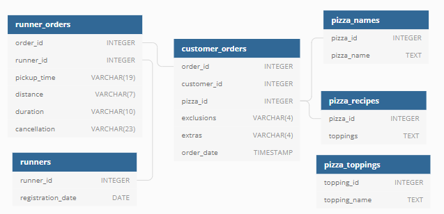

# Case Study #2 - Pizza Runner 🍕 #

### Inroduction ###
 - This case study has 5 parts
	- **A. Pizza Metrics: 10 Questions**
	- **B. Runner and Customer Experience: 7 Questions**
	- **C. Ingredient Optimisation: 6 Questions**
	- **D. Pricing and Ratings: 5 Questions**
	- **E. Bonus Question: 1 Question**
## ER Diagram

	
### 4 File description 📂 ###
**Data creation and Inserting Values**
- customer_orders.sql

- pizza_names.sql

- pizza_recipes.sql

- pizza_toppings.sql

- runner_orders.sql

- runners.sql

**Data Cleaning file**
- data_cleaning.sql -> Data Transformation and cleaning file.

**Solution file**
- a.pizza_metrics.sql

- b.runner_customer_experience.sql

- c.Ingredient_optimization.sql

- d.pricing_ratings.sql

