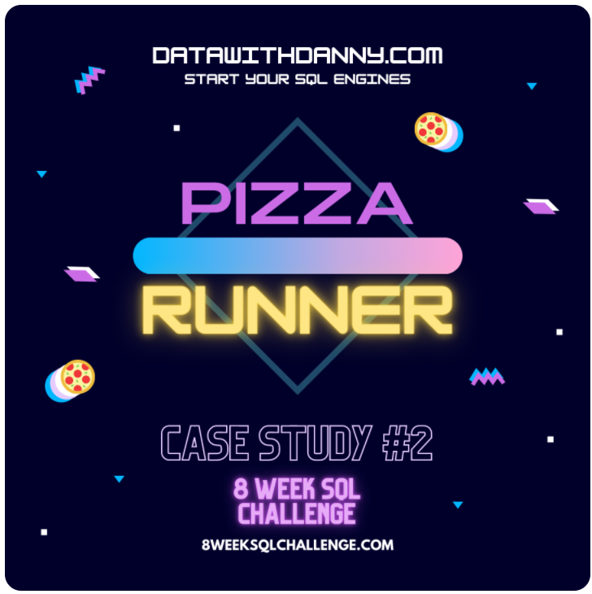

# Case Study #2 - Pizza Runner #

### Inroduction ###
 - This case study has 5 parts
	A. Pizza Metrics: 10 Questions
	B. Runner and Customer Experience: 7 Questions
	C. Ingredient Optimisation: 6 Questions
	D. D. Pricing and Ratings: 5 Questions
	E. Bonus Question: 1 Question
